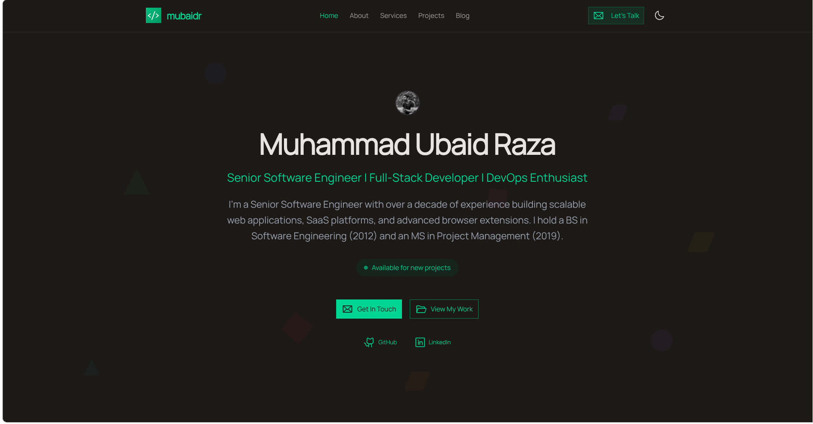

# Muhammad Ubaid Raza - Personal Portfolio & Blog

A modern, high-performance personal portfolio and blog website built with **Nuxt 3**, showcasing professional experience, projects, services, and technical insights.

<!--  -->

## 🌟 Live

[https://mubaidr.js.org](https://mubaidr.js.org)

## ✨ Features

### 📝 **Content Management**

- **Blog system** with markdown support and syntax highlighting
- **Project showcase** with detailed case studies
- **Services portfolio** with pricing and packages
- **Professional testimonials** from clients
- **Contact forms** with email integration

### ⚡ **Performance & SEO**

- **100/100 Lighthouse score** for performance
- **Server-side rendering (SSR)** for optimal SEO
- **Static site generation** for fast loading
- **Image optimization** with automatic format conversion
- **Structured data** and rich snippets
- **Open Graph** and Twitter meta tags

### 🎨 **Modern Design & UX**

- **Minimal Luxury aesthetic** with elevated surfaces and warm neutrals
- **Dark/Light mode toggle** with system preference detection
- **Fully responsive** design for all devices
- **Refined animations** with reduced-motion support
- **Accessible** components built on Nuxt UI 4

### 🔧 **Developer Experience**

- **TypeScript** support throughout the project
- **ESLint & Prettier** for code quality
- **Hot module replacement** for fast development
- **Automated deployment** to GitHub Pages
- **Content-driven** architecture with YAML/Markdown

### Quick Update Guide

All content is managed in YAML files—no code changes needed:

- **Update hero headline:** Edit `heroHeadline` in `content/profile.yml`
- **Add case studies:** Add entries to `caseStudies` array in `content/case-studies.yml`
- **Change timezone:** Edit `availability.timezone` in `content/profile.yml`
- **Adjust pricing:** Update `pricingRanges` object in `content/profile.yml`
- **Modify audiences:** Edit `whoIWorkWith` array in `content/profile.yml`

All changes automatically reflect on the homepage after save.

## �🛠️ Tech Stack

### **Frontend Framework**

- **[Nuxt 3](https://nuxt.com/)** - Vue.js meta-framework
- **[Vue 3](https://vuejs.org/)** - Progressive JavaScript framework
- **[TypeScript](https://www.typescriptlang.org/)** - Type-safe JavaScript

### **UI & Styling**

- **[Nuxt UI 3](https://ui3.nuxt.dev/)** - Beautiful and accessible UI components
- **[Tailwind CSS 4](https://tailwindcss.com/)** - Utility-first CSS framework
- **[Nuxt Icon](https://github.com/nuxt/icon)** - Icon management system
- **[Nuxt Fonts](https://fonts.nuxt.com/)** - Web font optimization

### **Content Management**

- **[Nuxt Content](https://content.nuxt.com/)** - File-based CMS with markdown support
- **[MDC](https://content.nuxt.com/usage/markdown)** - Markdown components
- **[@tailwindcss/typography](https://tailwindcss.com/docs/typography-plugin)** - Beautiful typography

### **SEO & Analytics**

- **[Nuxt SEO](https://nuxtseo.com/)** - Complete SEO toolkit
- **[nuxt-schema-org](https://nuxtseo.com/schema-org/getting-started/introduction)** - Structured data
- **[@nuxtjs/color-mode](https://color-mode.nuxtjs.org/)** - Dark/light mode

### **Development Tools**

- **[ESLint](https://eslint.org/)** - Code linting
- **[Prettier](https://prettier.io/)** - Code formatting
- **[Nuxt DevTools](https://devtools.nuxt.com/)** - Development experience
- **[Nuxt Studio](https://nuxt.studio/)** - Content editing

### **Deployment & Hosting**

- **[GitHub Pages](https://pages.github.com/)** - Static site hosting
- **[GitHub Actions](https://github.com/features/actions)** - CI/CD pipeline
- **Brotli & Gzip compression** for optimal loading

## 📁 Project Structure

```
├── app/                      # Application source code
│   ├── components/          # Vue components
│   │   ├── CallToAction.vue
│   │   ├── FeaturedBlogPosts.vue
│   │   ├── FeaturedProjects.vue
│   │   ├── GeometricBackground.vue
│   │   ├── RecentBlogPosts.vue
│   │   ├── ServicesPreview.vue
│   │   ├── SiteFooter.vue
│   │   ├── SiteHeader.vue
│   │   ├── TestimonialsPreview.vue
│   │   └── ThemeSwitcher.vue
│   ├── layouts/             # Layout templates
│   │   └── default.vue
│   ├── pages/               # Application pages
│   │   ├── about.vue
│   │   ├── contact.vue
│   │   ├── index.vue
│   │   ├── privacy.vue
│   │   ├── projects.vue
│   │   ├── services.vue
│   │   ├── terms.vue
│   │   └── blog/
│   ├── assets/css/          # Stylesheets
│   ├── plugins/             # Nuxt plugins
│   ├── app.config.ts        # App configuration
│   └── app.vue              # Root component
├── content/                 # Content files
│   ├── authors/             # Author profiles
│   ├── blog/                # Blog posts (Markdown)
│   ├── testimonials/        # Client testimonials
│   ├── faqs.yml             # Frequently asked questions
│   ├── professional-journey.yml
│   ├── profile.yml          # Personal profile data
│   ├── projects.yml         # Portfolio projects
│   └── services.yml         # Service offerings
├── public/                  # Static assets
│   ├── img/                 # Images and media
│   ├── brand.png           # Brand assets
│   ├── favicon.png
│   └── mubaidr.png
├── types/                   # TypeScript definitions
├── nuxt.config.ts          # Nuxt configuration
├── content.config.ts       # Content configuration
├── package.json            # Dependencies and scripts
└── tsconfig.json           # TypeScript configuration
```

## 🚀 Getting Started

### Prerequisites

- **Node.js** >= 23.0.0
- **npm** >= 10.0.0

### Installation

1. **Clone the repository**

```bash
git clone https://github.com/mubaidr/mubaidr.js.org.git
cd mubaidr.js.org
```

1. **Install dependencies**

```bash
npm install
```

1. **Start development server**

```bash
npm run dev
```

1. **Open in browser**

```
http://localhost:3000
```

### Build & Deploy

```bash
# Build for production
npm run build

# Generate static site
npm run generate

# Preview production build
npm run preview

# Lint code
npm run lint

# Format code
npm run format
```

## 📄 Content Management

### Adding Blog Posts

Create a new markdown file in [`content/blog/`](./content/blog/):

```markdown
---
title: "Your Blog Post Title"
description: "Brief description of your post"
date: "2025-01-01"
tags: ["nuxt", "vue", "typescript"]
image: "/img/blog/your-post/featured.webp"
author: "mubaidr"
---

# Your Blog Content

Write your blog content here using markdown...
```

### Managing Projects

Edit [`content/projects.yml`](./content/projects.yml) to add or update portfolio projects:

```yaml
projects:
  - id: 1
    title: "Project Name"
    description: "Brief project description"
    longDescription: "Detailed project description"
    technologies: ["Nuxt 3", "TypeScript", "Tailwind CSS"]
    category: "Web Application"
    featured: true
    status: "active"
    links:
      github: "https://github.com/username/repo"
      demo: "https://demo.example.com"
```

### Updating Services

Modify [`content/services.yml`](./content/services.yml) to manage service offerings and pricing.

## 🎯 Key Pages & Features

| Page                      | Description                    | Features                                |
| ------------------------- | ------------------------------ | --------------------------------------- |
| **[Home](/)**             | Landing page with hero section | Profile showcase, featured content, CTA |
| **[About](/about)**       | Professional background        | Journey timeline, skills, approach      |
| **[Projects](/projects)** | Portfolio showcase             | Filterable grid, detailed project cards |
| **[Blog](/blog)**         | Technical articles             | Pagination, search, categories          |
| **[Services](/services)** | Service offerings              | Pricing packages, process workflow      |
| **[Contact](/contact)**   | Get in touch                   | Contact form, social links              |

## 📊 Performance Metrics

- **Lighthouse Score**: 100/100 (Performance, Accessibility, Best Practices, SEO)
- **Average Load Time**: < 0.8 seconds
- **Bundle Size**: Optimized with tree-shaking and code splitting
- **Core Web Vitals**: Excellent ratings across all metrics

## 🔧 Customization

### Theme Colors

Update theme colors in [`app/app.config.ts`](./app/app.config.ts):

```typescript
export default defineAppConfig({
  ui: {
    colors: {
      primary: "emerald", // Change primary color
      neutral: "stone", // Change neutral color
    },
  },
})
```

### Site Configuration

Modify site settings in [`nuxt.config.ts`](./nuxt.config.ts):

```typescript
export default defineNuxtConfig({
  site: {
    url: "https://yourdomain.com",
    name: "Your Name - Your Title",
    description: "Your site description",
  },
})
```

## 🤝 Contributing

Contributions are welcome! Please feel free to submit a Pull Request.

1. Fork the repository
2. Create your feature branch (`git checkout -b feature/AmazingFeature`)
3. Commit your changes (`git commit -m 'Add some AmazingFeature'`)
4. Push to the branch (`git push origin feature/AmazingFeature`)
5. Open a Pull Request

## 📝 License

This project is open source and available under the [MIT License](LICENSE).

## 👨‍💻 Author

**Muhammad Ubaid Raza**

- Website: [https://mubaidr.js.org](https://mubaidr.js.org)
- GitHub: [@mubaidr](https://github.com/mubaidr)
- LinkedIn: [Muhammad Ubaid Raza](https://linkedin.com/in/mubaidr)
- Email: [mubaidr@gmail.com](mailto:mubaidr@gmail.com)

---

<div align="center">

**⭐ Star this repository if you find it helpful!**

Built with ❤️ using [Nuxt 3](https://nuxt.com/) and [Nuxt UI](https://ui3.nuxt.dev/)

</div>
