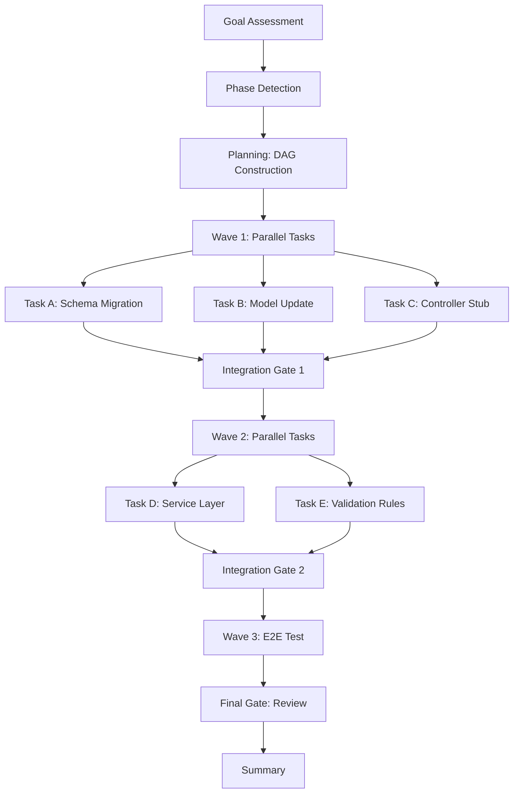

## Production-Grade AI Agents Are Not Prompts - They Are Systems

I learned this lesson the hard way. In early 2025, I built what I thought was a clever AI agent for a Laravel application. It was a single prompt chain: receive a bug report, analyze the stack trace, search the codebase, generate a fix, apply it. Five steps chained together with a template that read "Based on the following context, generate..." at each hop. It worked beautifully in the demo. Then we put it on a real repository with real issues, and it fell apart within 24 hours.

The prompt chain hallucinated a fix for an authentication bug by modifying the wrong file. It invented a database column that did not exist. It left the codebase in an inconsistent state, and because there was no rollback mechanism and no observability, it took me two hours to undo the damage. That was the moment I stopped thinking of AI agents as prompts and started thinking of them as systems.

This post is about what I learned since then: why prompt-only agents fail, what distinguishes the three tiers of agent sophistication, and how the Gem-Team architecture solves the reliability problem with directed acyclic graph execution, deterministic routing, and wave-based parallelism. If you are building AI agents for production in 2026, this is the architecture I wish I had from day one.

## Why Prompt-Only Agents Fail in Production

The failure modes of prompt-chained agents are not random. They follow predictable patterns that I have now seen across multiple projects, including the Laravel stack I maintain and the Nuxt applications I deploy.

**Context drift accumulates with every hop.** A prompt chain passes context from one step to the next. Each step reformats, summarizes, or filters that context. After four or five hops, the original problem description has degraded into something the LLM barely recognizes. I watched a five-step bug-fixing chain turn "user login returns 500 error" into "modify the UserController to add a new method" by step three, because the intermediate representation lost the constraint that we were fixing a bug, not adding a feature. The chain produced plausible code that solved the wrong problem.

**There is no recovery path.** When a prompt chain produces an incorrect intermediate result, every subsequent step compounds the error. A typical chain does not check its own output. It does not verify that a generated SQL migration matches the schema. It does not validate that a code change compiles. It just passes the output to the next prompt template. In the Laravel project I mentioned, the fix-for-auth-bug chain never verified that the User model had the column it was referencing. The LLM assumed the column existed because it looked plausible. The chain had no guard.

**Observability is nonexistent.** When a prompt chain fails, you get the final output. You do not get step-level traces, confidence scores, or decision logs. You cannot answer the question "why did the agent choose to modify this file?" because the chain does not record the reasoning. Debugging becomes guesswork. I spent those two hours not fixing the bug but reconstructing what the agent had done and why.

**No deterministic routing.** A prompt chain follows a fixed sequence regardless of the input. A simple typo fix goes through the same five steps as a database migration. There is no phase detection, no complexity assessment, no routing to specialized handlers. The chain is rigid, and rigidity in AI systems guarantees brittleness.

These failure modes are not fixable with better prompts. They are architectural. The chain structure itself is the problem.

## Three Tiers of Agent Sophistication

After the Laravel failure, I categorized every agent framework I could find into three tiers. Understanding where your system falls on this spectrum is the first step toward building something production-grade.

| Tier | Name                     | Routing                                   | State                   | Recovery                                       | Example                                  |
| ---- | ------------------------ | ----------------------------------------- | ----------------------- | ---------------------------------------------- | ---------------------------------------- |
| 1    | Prompt Chain             | Fixed sequential                          | None                    | None                                           | Single-LLM script with template steps    |
| 2    | Tool-Using Agent         | Model-decided routing                     | Ephemeral               | Retry with same prompt                         | ReAct-style agents, ChatGPT with plugins |
| 3    | Orchestrated Multi-Agent | Deterministic DAG with specialist routing | Persistent across waves | Diagnose-then-fix loop with confidence scoring | Gem-Team, custom orchestrators           |

### Tier 1: Prompt Chains

This is where most hobby projects and early prototypes live. A prompt chain is a script that calls an LLM multiple times, passing the output of one call as context to the next. The sequence is hardcoded. There is no conditional branching based on output quality. There is no state management beyond the text passed between steps.

Prompt chains are useful for one thing: prototyping. If you need to prove that an LLM can perform a multi-step task, a prompt chain is the fastest way to test the hypothesis. But shipping a prompt chain to production is like shipping a prototype without error handling. I did it once. I will not do it again.

### Tier 2: Tool-Using Agents

Tool-using agents improve on chains by letting the model decide which tool to call next. The ReAct pattern (Reasoning + Acting) is the most common example. The model receives a list of available functions, reasons about which to call, and iterates until it decides the task is complete.

These agents appear flexible, but they introduce a new failure mode: the model makes routing decisions without understanding the full context. I watched a ReAct-style agent call a "search codebase" tool seven times in a loop, each time with slightly different phrasing, because it lacked the confidence to stop. The state is ephemeral -- when the context window fills, earlier reasoning is lost. Recovery is limited to retrying the same action, which produces the same result.

Tier 2 works for narrow, well-scoped tasks with clear termination criteria. It does not work for multi-file changes, cross-system integrations, or tasks where sequence matters.

### Tier 3: Orchestrated Multi-Agent Systems

This is the tier where agents become production systems. An orchestrator sits above the LLM calls and makes three critical decisions that prompt chains and tool-using agents leave to chance: which phase of work we are in, which specialist agent should handle it, and whether the output meets quality thresholds before proceeding.

The orchestrator does not just pass text between steps. It maintains a persistent state across waves of execution. It constructs a directed acyclic graph (DAG) of tasks, where edges represent dependencies and nodes represent work units assigned to specialist agents. It runs tasks in parallel when dependencies allow. It checks integration quality between waves. And when something fails, it runs a structured diagnostic loop instead of blindly retrying.

I built the Gem-Team orchestrator to encode these patterns explicitly. The rest of this post walks through the architecture that makes Tier 3 work.

## Gem-Team Architecture: DAG Execution and Deterministic Routing

The Gem-Team orchestrator follows a five-phase workflow, but the core architectural difference is how it represents and executes work. Instead of a linear chain or a model-driven loop, it uses a directed acyclic graph of tasks, grouped into execution waves.

### Phase Detection

The orchestrator starts by assessing the incoming goal. It does not assume every request needs the same workflow. A one-line bug fix skips straight to execution. A feature request that touches authentication, database schema, and frontend components triggers the full pipeline.

```typescript
// Phase detection logic from gem-orchestrator
type GoalComplexity = "simple" | "medium" | "complex"
type WorkflowPhase =
  "discuss" | "prd" | "research" | "planning" | "execution" | "summary"

interface GoalAssessment {
  complexity: GoalComplexity
  phases: WorkflowPhase[]
  riskFactors: string[]
  affectedAreas: string[]
}

function assessGoal(
  description: string,
  context: CodebaseContext,
): GoalAssessment {
  const complexity = detectComplexity(description, context)
  const phases = determinePhases(complexity, context)

  return {
    complexity,
    phases,
    riskFactors: identifyRisks(description, context),
    affectedAreas: identifyAffectedAreas(description, context),
  }
}
```

The `determinePhases` function encodes the routing rules. Simple changes go directly to planning then execution. Changes that touch security, data migration, or public APIs trigger the discuss and PRD phases. The orchestrator does not ask the LLM which phase to use. It applies deterministic rules based on signals from the codebase analysis.

### DAG Construction and Wave-Based Execution

Once the planning phase completes, the orchestrator has a list of tasks with dependencies. It constructs a DAG and groups tasks into waves. Tasks in the same wave have no dependencies on each other and can run in parallel. Waves execute sequentially, with an integration gate between them.



Each integration gate runs gem-reviewer against the current state of the codebase. The reviewer checks that the build compiles, existing tests pass, and new code follows project conventions. If the gate fails, gem-debugger enters the diagnose-then-fix loop.

### The Wave Executor

The wave executor is the runtime component that manages parallel agent execution. It spins up to four specialist agents concurrently, each handling one task from the wave. Each agent operates independently, with its own context window and its own completion criteria.

```typescript
// Simplified wave executor from gem-orchestrator
interface Wave {
  id: string
  tasks: Task[]
  gate: IntegrationGate
}

interface Task {
  id: string
  agent: string
  specification: string
  dependencies: string[]
  status: "pending" | "running" | "completed" | "failed"
}

async function executeWave(
  wave: Wave,
  state: ExecutionState,
): Promise<WaveResult> {
  const results = await Promise.allSettled(
    wave.tasks.map((task) => executeTask(task, state)),
  )

  const failures = results.filter(
    (r) => r.status === "rejected",
  ) as PromiseRejectedResult[]
  if (failures.length > 0) {
    return { status: "wave_failed", failures }
  }

  // Integration gate
  const gateResult = await runIntegrationGate(wave.gate, state)
  if (!gateResult.passed) {
    const diagnosis = await diagnoseFailure(gateResult, state)
    const fixResult = await applyFix(diagnosis, state)
    if (!fixResult.applied) {
      return { status: "gate_failed", diagnosis, fixResult }
    }
  }

  return { status: "wave_completed" }
}
```

The `Promise.allSettled` call is deliberate. It lets every task in the wave run to completion, even if some fail. This gives the diagnostic loop the full picture before attempting recovery. A task that succeeds provides context for fixing a related failure.

## Failure Handling Patterns

The diagnose-then-fix loop is the most important pattern in the Gem-Team architecture. It separates the concerns of detection, diagnosis, and remediation into distinct steps, each handled by a specialist agent.

Detection happens at the integration gate. The gate runs automated checks -- build, lint, type-check, test -- and collects any failures into a structured error report. This report goes to gem-debugger, not back to the original task agent.

Diagnosis follows a structured protocol. gem-debugger receives the error report, reads the relevant source files, and produces a scored root cause analysis. The confidence score must reach a threshold of 0.7 before any fix is attempted.

```typescript
interface Diagnosis {
  rootCause: string
  targetFiles: string[]
  confidence: number // 0.0 to 1.0, threshold 0.7
  fixRecommendations: FixRecommendation[]
}

interface FixRecommendation {
  file: string
  lineStart: number
  lineEnd: number
  suggestedChange: string
  rationale: string
}
```

If confidence is below 0.7, the orchestrator escalates to the developer. This prevents the system from making destructive changes based on an uncertain diagnosis. I added this threshold after watching an agent "fix" a test failure by deleting the test file. It was technically correct -- the test passed after deletion -- but it was not the right answer.

Remediation applies the fix recommendation and re-runs the gate. If the gate passes, execution proceeds. If it fails again, the loop cycles with the new error context. The orchestrator limits the retry count to three iterations before escalating.

## Green Flags and Red Flags for Agent Systems

After building and maintaining the Gem-Team framework, I have developed a rubric for evaluating agent architectures. Here are the signals I look for.

**Green flags:**

- Tasks are represented as a structured graph with explicit dependencies, not as steps in a prompt template.
- The system has a state model that persists across execution waves. If the agent cannot answer "what tasks are running, which completed, and what failed," it does not have real state.
- Specialist agents are routed by the system, not chosen by the model. Routing decisions are deterministic rules, not LLM guesses.
- Failure handling has a diagnostic phase that captures error context and source code before attempting a fix.
- There are quality gates between execution stages, and those gates run real verification (build, test, lint), not LLM-based evaluation.

**Red flags:**

- The system is a single script that calls an LLM multiple times and passes text between calls. No state, no graph, no gate.
- The model decides which tools to call and in what order, with no system-level constraints on looping or termination.
- There is no difference between "the plan" and "the prompt." If the task list is embedded in a text string inside the system prompt, it is not a plan.
- Error handling consists of "retry with the same prompt" or "append 'please try again' to the context."
- There is no record of what decisions the agent made or why. If a stakeholder asks "why did the agent modify this file?" and you cannot answer, the system is not production-grade.

I have been guilty of every red flag on this list. The Laravel chain hit all of them. Moving from red to green required rewriting the architecture, not improving the prompts.

## Migration Path from Prompt Chains

If you have a Tier 1 or Tier 2 system today, you do not need to throw it away. The migration path is incremental.

First, extract the state. Instead of passing text between steps, build an explicit state object that tracks which phase the system is in, what tasks have completed, and what artifacts each task produced. This is the smallest change that makes a difference. Once you have explicit state, you can add conditional branching -- skip steps when the input does not require them.

Second, add gates. After each step, run a verification check. For code generation tasks, check that the code compiles. For data tasks, validate the output against your schema. The gate does not need to be sophisticated. A shell command that runs `tsc --noEmit` is infinitely better than no gate at all.

Third, introduce specialist routing. Identify the distinct capabilities your system needs -- research, planning, implementation, review, testing -- and assign each to a dedicated prompt or agent definition. The orchestrator routes tasks based on type, not based on what the model thinks it should do next.

Fourth, replace the linear chain with a DAG. This is the hardest step because it requires thinking about parallelism and dependency ordering. But it is also the step that provides the most value. Once tasks can run in parallel, total execution time drops, and the system can handle larger, more complex goals.

The Gem-Team framework went through this exact migration. The earliest version was a prompt chain with four steps. Version 1.6.0 introduced specialist mobile agents. Version 1.20.0 added the orchestrator that routes to those agents using the DAG model. Each step made the system more reliable without completely discarding the previous work.

## The Consulting Signal

I now refuse to build agent systems that use Tier 1 architectures for production workloads. When a client asks me to add "AI features" to their Laravel or Nuxt application, I start with the architecture conversation, not the prompt conversation. I ask how the system will handle failures, how it will maintain state across multi-step operations, and how we will know when it produces incorrect output. If the answer to all three is "the LLM will figure it out," the project needs an architecture review before it needs a code review.

The consulting work I do around agent systems has shifted from prompt engineering to system design. The prompts matter, but they matter in the same way that function signatures matter in a distributed system -- they define the contract at each boundary, but they do not determine whether the system as a whole is reliable. Reliability comes from the orchestration layer: the state model, the dependency graph, the quality gates, and the failure recovery loops.

Production-grade AI agents are not prompts. They are systems. The sooner the industry internalizes this, the fewer demos we will see that work perfectly in isolation and fail catastrophically in production. I learned this by breaking my own application. You can learn it from my mistake instead of making your own.

---

_This post is part of the [AI Systems Engineering](/blog/series/ai-systems-engineering) series. Next: Observability patterns for multi-agent systems -- what to log, how to trace decisions, and how to debug failures across distributed agent workflows._
