## The Pipeline That Worked at 10 Tasks but Broke at 100

I built my first AI agent pipeline in early 2024. It was beautiful in its simplicity: agent A runs, passes results to agent B, which feeds agent C, and so on down the chain. For ten tasks with straightforward dependencies, it worked flawlessly. Each step took a well-defined input, produced an expected output, and the whole system was easy to reason about.

When I scaled it to a hundred tasks, the cracks became chasms.

The first sign was latency. Task 87 couldn't start until tasks 84 through 86 completed, even though 87 only needed output from task 84. Tasks 85 and 86 were independent of each other but ran serially because the pipeline had no concept of parallelism. The total wall-clock time was the sum of every step, not the length of the critical path.

The second sign was cost. Every LLM call in the pipeline carried the same error probability. With ten steps at 95% per-step reliability, the system succeeded 60% of the time. With a hundred steps, that dropped below 1%. I was spending thousands of tokens on calls that would be invalidated by an upstream failure.

The third sign was the failure cascade. When task 12 returned malformed JSON, every downstream task failed too. There was no way to isolate the damage, retry the failed node, or route around it. The entire pipeline had to restart from the beginning.

I needed a fundamentally different architecture. That is when I started building the DAG-based executor that now powers the gem-team orchestrator.

## The Problem: Why Sequential Pipelines Are a Scaling Trap

Linear pipelines convert a complex workflow into a sequence of steps. Each step is an LLM call, a function call, or an agent invocation that depends on the previous step's output. This model is seductive because it mirrors how we think about procedures: do this, then do that, then do the other thing.

But LLM-based agents are not deterministic functions. They produce variable outputs, consume variable time, and fail in unpredictable ways. A pipeline designed for deterministic compute breaks when applied to non-deterministic agents for three structural reasons.

**Error compounding.** Each LLM call introduces a distribution of possible outputs. When step A passes its output to step B, B inherits not just the data but any errors, ambiguities, or hallucinations from A. By step N, the accumulated noise can swamp the signal. In my experience, pipelines beyond six to eight steps produce outputs that are measurably worse than the same budget spent on parallel, independent calls with a merge step.

**No parallelism.** A pipeline serializes everything. If steps B and C both need output from step A but do not need each other, they still execute one after the other. This is the most obvious performance tax. For a code review pipeline with four independent analyses -- linting, type checking, security scanning, and test impact analysis -- running them sequentially adds three times the latency with zero improvement in quality.

**Single points of failure.** When step 12 fails in a pipeline of 50 steps, steps 13 through 50 are wasted. The system offers no mechanism for partial completion, isolation, or alternate routes. The cost of failure scales with the length of the pipeline.

## What Is DAG Execution?

A directed acyclic graph (DAG) models a workflow as a set of nodes (tasks) with directional edges (dependencies). The graph has no cycles, which means the execution order is well-defined. The key insight is that the DAG captures only what must happen before what, leaving all other ordering to the executor.

The execution algorithm has three phases:

**Topological sort.** The executor computes a linear ordering of nodes where every node appears after all its dependencies. This guarantees correct execution order without over-constraining it.

**Wave computation.** Nodes with no unexecuted dependencies form a wave. The executor runs all nodes in a wave in parallel. When a wave completes, it resolves dependencies for the next wave and computes the new set of runnable nodes.

**Dependency resolution.** Each node declares its inputs as references to other nodes' outputs. The executor wires these references at runtime, passing resolved data only to nodes whose dependencies are satisfied.

This approach delivers three properties that linear pipelines cannot: parallel execution of independent branches, failure isolation to individual nodes, and automatic retry or rerouting when a node fails.

## Pipeline vs DAG: A Quantitative Comparison

I measured both approaches using the gem-team code review pipeline across fifty production pull requests. The pipeline used a fixed sequence of five analysis steps. The DAG used the same five steps as parallel nodes in wave one, followed by a merge step in wave two.

| Dimension                        | Linear Pipeline         | DAG Execution                          |
| -------------------------------- | ----------------------- | -------------------------------------- |
| Wall-clock time for 5 analyses   | 45 seconds              | 12 seconds                             |
| Total LLM calls                  | 5                       | 5                                      |
| Cost per run                     | 5x base token cost      | 5x base token cost                     |
| Successful first-run rate        | 68%                     | 91%                                    |
| Mean time to recovery on failure | 45 seconds (full retry) | 4 seconds (single node retry)          |
| Observability                    | Step-level logs         | Node-level logs with dependency graph  |
| Parallelism support              | None                    | Full                                   |
| Failure isolation                | None                    | Per-node                               |
| Retry strategy                   | Full pipeline restart   | Single node retry with state preserved |

The DAG completed in less than one-third the wall-clock time despite using the same number of LLM calls. The success rate improved because a malformed output from one analysis did not corrupt the others. When a node failed, the DAG retried only that node in under five seconds. The pipeline required a full restart costing 45 seconds.

## Building a DAG Executor: The Gem-Team Implementation

Here is the core executor I built for the gem-team orchestrator. It accepts a graph definition, resolves dependencies at runtime, and executes nodes in parallel waves.

```typescript
type NodeId = string
type NodeInput = Record<string, unknown>
type NodeOutput = Promise<Record<string, unknown>>

interface GraphNode {
  id: NodeId
  handler: (input: NodeInput) => Promise<Record<string, unknown>>
  dependencies: NodeId[]
}

interface ExecutionContext {
  nodeId: NodeId
  outputs: Map<NodeId, Record<string, unknown>>
  signal: AbortSignal
}

class DagExecutor {
  private nodes: Map<NodeId, GraphNode> = new Map()
  private adjacency: Map<NodeId, NodeId[]> = new Map()
  private completed: Set<NodeId> = new Set()
  private failed: Map<NodeId, Error> = new Map()

  addNode(node: GraphNode): void {
    this.nodes.set(node.id, node)
    for (const dep of node.dependencies) {
      if (!this.adjacency.has(dep)) {
        this.adjacency.set(dep, [])
      }
      this.adjacency.get(dep)!.push(node.id)
    }
  }

  private getReadyNodes(): GraphNode[] {
    const ready: GraphNode[] = []
    for (const [id, node] of this.nodes) {
      if (this.completed.has(id) || this.failed.has(id)) continue
      const allDepsMet = node.dependencies.every((dep) =>
        this.completed.has(dep),
      )
      if (allDepsMet) ready.push(node)
    }
    return ready
  }

  private gatherInput(node: GraphNode): NodeInput {
    const input: NodeInput = {}
    for (const dep of node.dependencies) {
      const depOutput = this.outputs.get(dep)
      if (depOutput) {
        input[dep] = depOutput
      }
    }
    return input
  }

  async execute(
    signal: AbortSignal,
  ): Promise<Map<NodeId, Record<string, unknown>>> {
    const outputs = new Map<NodeId, Record<string, unknown>>()

    while (this.completed.size + this.failed.size < this.nodes.size) {
      if (signal.aborted) throw new Error("Execution aborted")

      const wave = this.getReadyNodes()
      if (
        wave.length === 0 &&
        this.completed.size + this.failed.size < this.nodes.size
      ) {
        throw new Error("Deadlock detected: unsatisfied dependencies remain")
      }

      const results = await Promise.allSettled(
        wave.map((node) => {
          const input = this.gatherInput(node)
          return node.handler(input).then((result) => ({ id: node.id, result }))
        }),
      )

      for (const result of results) {
        if (result.status === "fulfilled") {
          outputs.set(result.value.id, result.value.result)
          this.completed.add(result.value.id)
        } else {
          const failedNode = wave.find(
            (n) => !this.completed.has(n.id) && !this.failed.has(n.id),
          )
          if (failedNode) {
            this.failed.set(failedNode.id, result.reason)
          }
        }
      }
    }

    return outputs
  }
}
```

The executor computes waves by checking which nodes have all dependencies satisfied. Nodes in the same wave execute in parallel via `Promise.allSettled`, which ensures one failure does not block the others. The abort signal provides cancellation without manual intervention.

A real production executor adds retry logic, timeout per node, circuit breakers for repeated failures, and persistent state for long-running workflows. The gem-team orchestrator extends this base with wave scheduling that respects token budgets and priority levels.

## Branching Agent Flows: A Mermaid Diagram

The following diagram shows how a DAG-based code review pipeline processes a pull request. Wave one runs four independent analyses in parallel. Wave two merges results into a consolidated review. Wave three posts the review and triggers follow-up actions.

```mermaid
flowchart TD
  A["PR Submitted"] --> B["Wave 1: Parallel Analysis"]

  subgraph B["Wave 1: Parallel Analysis"]
    C["Lint Analysis"]
    D["Type Check"]
    E["Security Scan"]
    F["Test Impact Analysis"]
  end

  C --> G["Wave 2: Merge"]
  D --> G
  E --> G
  F --> G

  G --> H["Consolidated Report"]

  H --> I["Wave 3: Conditional Actions"]
  I --> J["Post Review Comment"]
  I --> K["Request Changes"]
  I --> L["Approve & Merge"]

  style B fill:#1a1a2e,stroke:#4361ee,stroke-width:2px
  style G fill:#1a1a2e,stroke:#4361ee,stroke-width:2px
  style I fill:#1a1a2e,stroke:#4361ee,stroke-width:2px

  K --> M["Wave 4: Follow-up"]
  M --> N["Assign to Author"]
  M --> O["Create Issue"]
```



The critical insight is that the lint analysis, type check, security scan, and test impact analysis each take 8 to 12 seconds in isolation. Running them sequentially costs 40-plus seconds. Running them in wave one costs a maximum of 12 seconds -- the runtime of the slowest analysis. The DAG does not make individual tasks faster. It makes the system faster by never making tasks wait unnecessarily.

## Real Example: Code Review Pipeline with Parallel Analyses

In the gem-team repository, the code review agent uses a DAG with four parallel nodes in wave one. I will walk through how each node operates and what happens when one fails.

**Lint analysis** checks the diff against the project's ESLint configuration. It identifies style violations, unused imports, and potential anti-patterns. This node is fast, typically completing in under three seconds. Its output feeds the consolidated report but does not block the other analyses.

**Type check** compiles the changed files with strict TypeScript settings. This node catches type errors that the linter would miss, such as mismatched interfaces or incorrect generic parameters. It takes eight to ten seconds for a typical pull request.

**Security scan** examines the diff for common vulnerability patterns: SQL injection surfaces, unsanitized user input, hardcoded credentials, and overly permissive CORS configurations. It runs in about six seconds and produces a list of severity-ranked findings.

**Test impact analysis** determines which test suites cover the changed code and runs them. This is the most variable node. For a simple change, it completes in four seconds. For a change touching shared utilities, it may need fifteen seconds to run the full affected test suite.

When all four nodes succeed, wave two merges their outputs into a consolidated review. When one node fails -- say the security scan times out on a very large diff -- the DAG flags the failure, retries the security scan once, and completes the consolidated report with a warning. The other three analyses are unaffected.

A linear pipeline handling this scenario would need to decide whether to fail the entire review or implement complex branching logic within a single sequential flow. The DAG handles it as a matter of course: one node failed, three succeeded, the merge step accounts for partial results.

## Failure Handling: How DAG Isolation Prevents Cascade Failures

The most important property of DAG execution is failure isolation. When a node fails, its error does not propagate to sibling nodes. Only downstream nodes that depend on the failed node are affected, and even then the executor can provide fallback data or skip optional dependencies.

The gem-team orchestrator implements three failure strategies:

**Retry with backoff.** The executor retries failed nodes up to three times with exponential backoff. Many LLM failures are transient -- a timeout, a rate limit, a temporary service interruption. A simple retry resolves over 70% of failures in production.

**Fallback outputs.** For optional dependencies, the executor injects a default value when a node fails. The consolidated review step, for example, can proceed with partial analysis results if one scanner fails. The review notes the missing analysis so the developer knows what was skipped.

**Subgraph rerouting.** For critical paths, the executor maintains alternate routes through the graph. If the primary security scanner is unavailable, the executor routes to a backup scanner or falls back to a simpler regex-based scan. This rerouting happens automatically because the DAG represents dependencies abstractly -- the executor only cares that the dependency is satisfied, not which node satisfies it.

A linear pipeline cannot offer any of these strategies. Once step 12 fails, there is nowhere to route. The pipeline is a single chain and every link is mandatory.

## When a Pipeline IS the Right Choice

DAG execution is not a universal replacement for linear pipelines. I have identified three scenarios where a simple pipeline outperforms a DAG.

**Deterministic, low-variance workflows.** When every step has a predictable runtime and near-zero failure rate, the overhead of graph construction, wave computation, and dependency resolution adds complexity without benefit. A shell script with pipes is the right tool for a sequence of grep, sort, and awk commands.

**Single-threaded LLM conversations.** A conversational agent that collects information step by step -- gather requirements, ask clarifying questions, synthesize -- works naturally as a pipeline. The sequential nature is a feature, not a bug, because each step depends on the conversational context built by the previous step.

**Resource-constrained environments.** DAG execution requires concurrent task scheduling. If your deployment environment cannot run multiple agents simultaneously -- a serverless function with a single-threaded runtime, for example -- the parallelism advantage disappears. In that case, a pipeline may be the only practical option.

The rule I follow: if the workflow has more than three steps and any two steps are independent of each other, use a DAG. Otherwise, a pipeline is fine.

## DAG as the Default for Production AI

After building and operating the gem-team orchestrator for over a year across hundreds of production workflows, I have reached a clear conclusion: DAG-based orchestration should be the default architecture for any AI system that coordinates multiple agent calls.

The numbers speak for themselves. The DAG executor reduced wall-clock time by 73% compared to the equivalent pipeline on the same workload. The per-run success rate improved from 68% to 91% because failures no longer cascade. Recovery time dropped from 45 seconds to under five because retries target individual nodes rather than the entire system.

The architectural benefits extend beyond latency and reliability. DAG execution produces a natural audit trail: every node's input, output, and execution time is recorded in the graph. Observability is a first-class property of the execution model, not something bolted on afterward. When a workflow produces an unexpected result, I can inspect the graph trace and identify exactly which node deviated from expectations.

I still use linear pipelines for simple, deterministic sequences. But for any system that coordinates multiple AI agents, analyzes multiple dimensions of a problem, or needs to survive individual task failures, I reach for a DAG. The complexity of building the graph is paid once. The reliability dividend is collected on every execution.

---

_This post is part of the [AI Systems Engineering](/blog/series/ai-systems-engineering) series. Previous: [Gem Team Orchestrator](/blog/34-gem-team-orchestrator). Next: TBD._
