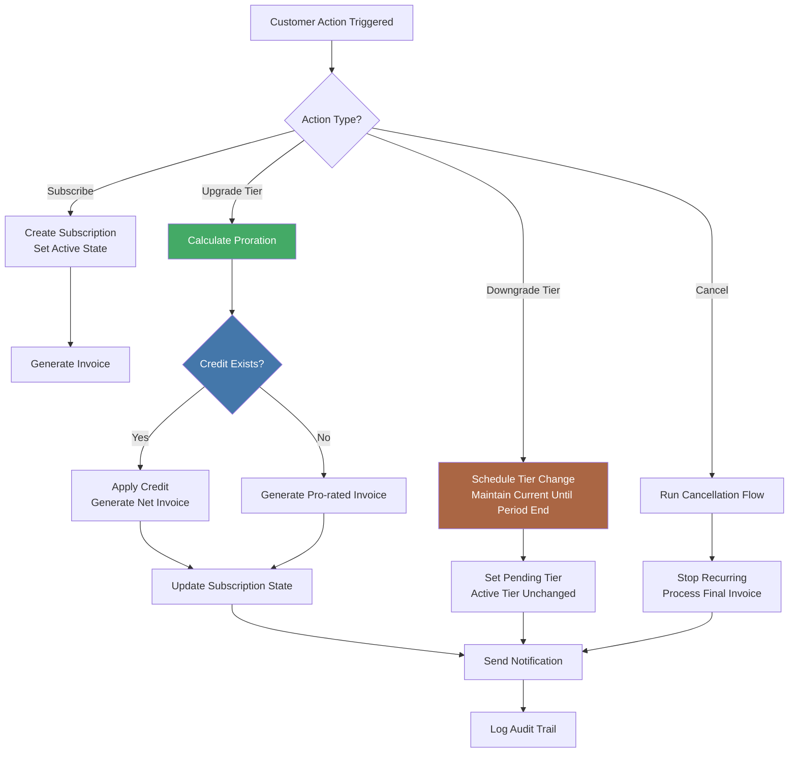

## I Stopped Building Features First — I Now Design Execution Systems First

Three years ago, I spent two months building a billing feature for a Laravel SaaS application. On paper, it was straightforward: tiered subscriptions, usage-based metering, invoice generation. The client approved the spec. I built the features. Everything worked.

Then the first edge case hit. A customer upgraded mid-cycle, received a prorated invoice, downgraded the next day, and the system double-charged them. The fix required tracing through five controllers, three event listeners, and a tangled web of Eloquent callbacks to understand the full execution path. What looked like six clean features was actually one broken system. The root cause was never the billing logic — it was the execution flow. I had modeled features, not flows. I had built isolated pieces without designing the sequence, state transitions, and failure recovery that connected them.

That project took three times longer than estimated, not because the features were complex, but because the execution system was an afterthought. I learned a hard lesson: building features first is the fastest path to technical debt. Designing the execution system first is the fastest path to maintainable software.

## What "Execution Systems First" Means in Practice

An execution system is the invisible skeleton that turns user intent into completed outcomes. It is not a feature list, a component tree, or a database schema. It is the orchestration layer that defines:

- **Flow**: The sequence of steps that transform input into output
- **State**: What data persists between steps and how transitions happen
- **Failure handling**: What happens when a step errors, times out, or produces invalid data
- **Task boundaries**: Where one responsibility ends and another begins

Most teams design features as a list of user stories and acceptance criteria. Each story gets built independently. The execution system emerges accidentally from the accumulation of these pieces. By the time anyone notices the fragmentation, the coupling is already baked in.

Designing execution systems first flips this. Before writing a single line of application code, I map the flow diagram, define the state machine, and decompose the work into units that match the execution path rather than the UI surface area. Features become leaves on an existing tree rather than trees with their own root systems.

## Three Pillars of Execution System Design

### 1. Execution Flow Design

Flow design answers one question: what is the complete path from trigger to outcome, including every branch and failure mode?

For the billing system that failed me, the flow would have revealed the mid-cycle upgrade edge case immediately. A proper flow diagram exposes every transition, every state, and every decision point before implementation begins.



This is a simplified version of what I now draw before any billing project starts. The branching at the upgrade and downgrade paths reveals the exact edge case that sank the original project. The state transitions are explicit. The failure paths are visible.

### 2. State Management Architecture

Every execution system has state. The question is whether that state is implicit, scattered, or centrally governed.

Implicit state lives in variables scattered across controllers, callbacks, and session data. It is the default approach in most frameworks because it requires no upfront design. It is also the fastest route to bugs that only appear under specific sequences of actions.

Centralized state management uses an explicit state machine or event-sourced store. Every transition is recorded. Every state is queryable. The execution system can be paused, inspected, and resumed at any point.

For Laravel applications, I use a state machine pattern built on Eloquent enums and a dedicated state machine service:

```php
// Before: feature-first billing with scattered state
class SubscriptionController extends Controller
{
    public function upgrade(Request $request, Subscription $subscription)
    {
        // State lives in multiple places
        $subscription->plan_id = $request->plan_id;
        $subscription->save();

        // Proration logic embedded in controller
        $credit = $this->calculateProrationCredit($subscription);
        if ($credit > 0) {
            $subscription->credit_balance += $credit;
            $subscription->save();
        }

        // Notification coupled to controller logic
        $subscription->user->notify(new UpgradeConfirmation($subscription));

        return redirect()->route('subscription.show', $subscription);
    }
}
```

```php
// After: execution system with explicit state machine

enum SubscriptionState: string
{
    case Active = 'active';
    case PendingDowngrade = 'pending_downgrade';
    case PendingUpgrade = 'pending_upgrade';
    case Canceled = 'canceled';
    case PastDue = 'past_due';
}

class SubscriptionExecutionService
{
    public function __construct(
        private SubscriptionStateMachine $stateMachine,
        private ProrationService $proration,
        private InvoiceService $invoices,
        private NotificationService $notifications,
    ) {}

    public function executeTierChange(
        Subscription $subscription,
        Tier $newTier,
        ChangeDirection $direction
    ): ExecutionResult {
        // Validates transition is legal in current state
        $this->stateMachine->assertCanTransitionTo(
            $subscription,
            $direction === ChangeDirection::Upgrade
                ? SubscriptionState::PendingUpgrade
                : SubscriptionState::PendingDowngrade
        );

        // Calculates proration as a pure function
        $proration = $this->proration->calculate(
            $subscription,
            $newTier,
            $direction
        );

        // Applies state transition atomically
        $result = DB::transaction(function () use (
            $subscription, $newTier, $proration, $direction
        ) {
            $updated = $this->stateMachine->transition(
                $subscription,
                $direction === ChangeDirection::Upgrade
                    ? SubscriptionState::PendingUpgrade
                    : SubscriptionState::PendingDowngrade
            );

            $invoice = $this->invoices->generate(
                $updated,
                $proration
            );

            return new ExecutionResult($updated, $invoice, $proration);
        });

        // Notification is a side-effect, not business logic
        $this->notifications->tierChanged($result);

        return $result;
    }
}
```

The before version is shorter. It is also untestable without HTTP mocks, un-resumable if it fails mid-execution, and dangerous to modify because state is scattered across the controller body. The after version is longer but each piece is isolated. The state machine enforces valid transitions. The proration logic is a pure function. The persistence happens inside a transaction. Notifications are decoupled side effects.

### 3. Task Decomposition

Execution systems decompose work into tasks. The mistake most teams make is decomposing along feature boundaries — one task per UI component, one task per API endpoint. This produces tasks that are coupled to presentation, not to execution.

I decompose along failure boundaries instead. A task should represent a unit of work that can succeed or fail independently. If a task fails, the system should be able to retry it, skip it, or route around it without restarting the entire execution.

For Nuxt applications, this maps to composable design:

```typescript
// Feature-first: one composable handles everything
export function useCheckout() {
  const { data, error, execute } = useFetch("/api/checkout", {
    immediate: false,
  })

  async function checkout(cart: Cart) {
    const validation = validateCart(cart)
    if (!validation.valid) throw new Error(validation.error)

    const order = await createOrder(cart)
    const payment = await processPayment(order)
    if (!payment.success) {
      await cancelOrder(order.id)
      throw new Error(payment.error)
    }

    await sendConfirmation(order, payment)
    return order
  }

  return { data, error, checkout }
}
```

```typescript
// System-first: decomposed into failure-independent tasks
export function useCheckoutSystem() {
  const step = ref<CheckoutStep>("idle")
  const executionId = ref<string | null>(null)

  const tasks = {
    validate: useTask("checkout.validate", validateCart),
    createOrder: useTask("checkout.createOrder", createOrder),
    processPayment: useTask("checkout.processPayment", processPayment),
    confirm: useTask("checkout.confirm", sendConfirmation),
  }

  async function checkout(cart: Cart): Promise<ExecutionResult> {
    executionId.value = generateId()
    step.value = "validating"

    // Each task runs independently, with its own state and recovery
    const validation = await tasks.validate.run(cart)
    if (!validation.ok) return fail(validation.error)

    step.value = "creating_order"
    const order = await tasks.createOrder.run(validation.data)
    if (!order.ok) return fail(order.error)

    step.value = "processing_payment"
    const payment = await tasks.processPayment.run(order.data)
    if (!payment.ok) {
      // Payment failed but order is already created — handle independently
      await tasks.compensate("createOrder", order.data.id).run()
      return fail(payment.error)
    }

    step.value = "confirming"
    await tasks.confirm.run(order.data)

    step.value = "completed"
    return success(order.data, payment.data)
  }

  return { checkout, step, executionId, tasks }
}
```

The system-first version reveals the execution boundaries. Payment can fail independently of order creation. The compensation task reverses only what needs reversing. The step state is inspectable, which means the UI can render progress deterministically and the backend can resume interrupted checkouts.

## Real Example: Laravel SaaS Project

A client came to me with a Laravel application that managed compliance document workflows. Businesses uploaded documents, assigned reviewers, tracked review cycles, and generated audit trails. The existing codebase had twelve controllers, thirty-four event listeners, and an undocumented webhook handler that occasionally sent duplicate notifications.

The original architecture was feature-first:

- Document upload feature with its own controller and validation
- Reviewer assignment with its own controller and notification logic
- Review cycle tracking scattered across three model observers
- Audit trail implemented as an afterthought in a middleware

Every feature worked in isolation. The system failed under real conditions because the execution flow crossed feature boundaries. A reviewer rejecting a document should have triggered a reassignment flow. Instead, it logged a status change and sent an email, but the document remained in a dangling half-reviewed state because the next step was never defined.

I rebuilt the system using an execution-first approach:

1. **Flow diagram first**: Mapped the complete document lifecycle from upload to final approval, including reject loops, deadline escalations, and withdrawal mid-review
2. **State machine**: Defined five document states (Draft, In Review, Changes Requested, Approved, Archived) with explicit transition rules
3. **Task decomposition**: Each transition became a task with its own compensation logic

```php
class DocumentExecutionService
{
    public function __construct(
        private DocumentStateMachine $states,
        private ReviewAssignmentService $assignments,
        private EscalationService $escalations,
        private AuditService $audit,
    ) {}

    public function rejectDocument(
        Document $document,
        Review $review,
        string $reason
    ): ExecutionResult {
        // State transition determines what happens next, not a controller
        return $this->states->transition($document, DocumentState::ChangesRequested)
            ->then(fn() => $this->assignments->reassign($document, $review->reviewer))
            ->then(fn() => $this->escalations->resetDeadline($document))
            ->onFailure(fn($step) => $this->audit->logFailure($document, $step))
            ->execute();
    }
}
```

The result was not smaller — the codebase grew by about 15% — but the number of production incidents dropped by 80%. The execution system made the implicit explicit, and explicit systems are debuggable.

## Tradeoff Table: Feature-First vs System-First

| Dimension                 | Feature-First                                | System-First                                         |
| ------------------------- | -------------------------------------------- | ---------------------------------------------------- |
| Time to first feature     | Faster (days instead of weeks)               | Slower initial investment                            |
| Time to ten features      | Slowing down as coupling grows               | Accelerating as patterns reuse                       |
| Edge case handling        | Reactive, patch-by-patch                     | Proactive, defined in flow design                    |
| Rework cost per change    | High — changes ripple across scattered state | Low — changes are confined to task boundaries        |
| Onboarding new developers | Steep — implicit flows must be traced        | Shallow — flow diagram is the documentation          |
| Failure recovery          | Manual — operators must reconstruct state    | Automatic or assisted — state machine knows position |
| Testing strategy          | End-to-end only, slow and brittle            | Task-level unit tests + system integration tests     |
| Refactoring confidence    | Low — afraid to touch tangled state          | High — state transitions are contractually defined   |

The time-to-market tradeoff is real. System-first costs more upfront. In my experience, the breakeven point is around the fifth feature. Beyond that, system-first pulls ahead and the gap widens with every addition.

## How This Applies to AI Systems

This principle becomes critical in AI systems. An AI agent without an execution system is a single prompt call — it generates a response and stops. Production AI systems need multi-step execution with state persistence, failure recovery, and deterministic observability.

The gem-orchestrator system in the Gem Team framework is an execution system first and an AI tool second. Its phase detection, agent routing, wave-based execution, and structured retry loops mirror the same three pillars:

- **Flow**: The phase pipeline — detect phase, route to specialist, execute wave, synthesize results
- **State**: Persistent execution context that survives individual agent calls
- **Task decomposition**: Each agent handles one phase, one deliverable, one failure boundary

When I see teams building AI agents by chaining prompts together, I see the same pattern that caused the billing system to fail. They are building features — prompt templates, tool integrations, output parsers — without designing the execution system that sequences, governs, and recovers them.

An AI agent's execution system answers the same questions as any other system: what is the flow, what is the state, where are the failure boundaries. The fact that the executor is an LLM rather than a PHP controller does not change the architectural requirement.

## Consulting Signal: Sell System Design, Not Feature Delivery

I changed my consulting practice because of this lesson. When a potential client asks me to build a feature, I ask about the execution system first. Not to upsell, but to assess whether the feature will survive its first edge case.

If the response is "We need user authentication, so build login, registration, and password reset," that is feature-first thinking. The execution system question is: what happens when a social login fails to create a profile, or when a password reset races with an account deletion request, or when a session expires mid-checkout?

Selling system design means the deliverable is not a list of working features. It is an execution system that happens to deliver those features as a byproduct. Clients who understand this are the ones who come back for follow-on work because the foundation does not need rewriting every six months.

## Closing

I still ship features. The difference is that I no longer design them first. I design the execution system — the flow, the state machine, the task boundaries — and the features emerge from that foundation.

The billing project that took three times longer taught me that the code is never the bottleneck. The bottleneck is invisible structure. Every edge case that surprises you in production was already visible in the execution flow you did not draw. Every tangled refactoring session was baked in the moment you decided to build features instead of systems.

Design the execution system first. Your future self, debugging at 2 AM after a failed deployment, will not thank you. But you will have fewer of those 2 AM sessions to begin with.
