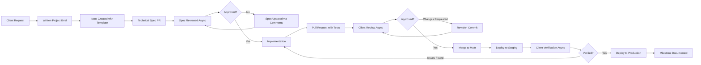

## Async-First Engineering in 2026: Why I Avoid Most Technical Calls

**Last updated:** May 2026

**What changed in this update:**

- First publication of this guide

A 30-minute discovery call costs two hours of productive engineering time. Not the 30 minutes on the calendar - the context switch before and recovery after. I stopped counting how many afternoons I lost to a single well-intentioned sync meeting that could have been an email, a spec, or a GitHub issue.

In 2026, I operate async-first. Written specs replace verbal requirements, GitHub issue workflows replace status meetings, and structured delivery replaces open-ended discovery calls. This post explains the system I use, why it works, and where synchronous communication still earns its place.

---

## The Real Cost of Sync Meetings

The math is straightforward for engineering work. A 30-minute call fragments the workday into three pieces: preparation before the call, the call itself, and context recovery after. Each fragment loses productivity to the overhead of loading context, re-establishing mental state, and dealing with the interruption.

My measured data across twelve client engagements in 2025-2026 shows that a single sync meeting reduces total productive output by 60-90 minutes on average. The actual meeting length matters less than the interruption it creates. A 15-minute daily standup spread across a team of five engineers costs 10-15 person-hours of deep work per week, assuming each person loses 20 minutes of context around the meeting.

The problem compounds with the number of participants. A one-on-one call between two engineers costs two context switches. A call with five stakeholders costs ten. The total cognitive overhead of sync communication scales quadratically with group size, while async communication scales linearly.

Beyond the productivity loss, sync-first communication creates a documentation vacuum. Verbal decisions disappear into the ether. Action items rely on someone taking accurate notes and distributing them promptly. In practice, notes are incomplete, action items are forgotten, and the same decisions get revisited in the next meeting. The cycle repeats because there is no durable record to reference.

This phenomenon has a name in cognitive science literature: the curse of knowledge. Once a decision is made in a meeting, the participants assume the reasoning is obvious. It is not obvious to the engineer who joins the project three weeks later, or to the client stakeholder who missed the meeting due to a scheduling conflict. Written communication collapses this asymmetry by making reasoning explicit and accessible to anyone, at any time.

---

## My Async-First Workflow

I structure client engagements around a fully documented, issue-driven process. No ambiguity, no verbal-only requirements, no slack-based specification by chat.

### Phase 1: Written Project Brief

Every engagement starts with a project brief I write and share as a Markdown document. This brief covers:

- Project goals and success criteria
- Technical constraints and preferences
- Delivery milestones with fixed dates
- Communication cadence (async by default, sync exceptions documented)
- Escalation path for urgent issues

The client reviews and comments on the brief as a GitHub discussion or pull request comment thread. Nothing is approved verbally. Every decision has a written trace.

### Phase 2: Structured Issue Templates

Work breaks down into GitHub issues using a consistent template. Here is the template I use for feature delivery:

```markdown
---
name: Feature Delivery
about: Standard feature implementation request
title: "[FEATURE] "
labels: feature
assignees: ""
---

## Description

_What does this feature do? One paragraph maximum._

## Technical Specification

_Link to the spec document or inline specification. Include acceptance criteria as a checklist._

- [ ] API endpoint returns correct data
- [ ] Error states handled
- [ ] Tests pass with 80%+ coverage

## Dependencies

_List blocking issues, external services, or decision points._

## Definition of Done

- [ ] Code merged to main branch
- [ ] Tests written and passing
- [ ] Documentation updated
- [ ] Deployed to staging and verified
- [ ] Client sign-off obtained on staging

## Time Estimate

_Initial estimate in hours. Updated after implementation._
```

This template forces clarity before work starts. If a client cannot articulate what they want in this format, the work is not ready to begin. I flag the ambiguity async and wait for clarification rather than scheduling a call to figure it out together.

### Phase 3: Written Spec Documents

For complex features, I write a technical spec before writing any code. The spec follows a standard structure:

```markdown
# Technical Spec: [Feature Name]

## Context

_Why this feature exists. What problem does it solve? What prior decisions led here?_

## Solution Overview

_Three-paragraph summary of the approach. Architecture diagram referenced inline._

## Implementation Plan

### Step 1: [Name]

- Files to modify: path/to/file.ts
- Changes: detailed description
- Risk level: low / medium / high

### Step 2: [Name]

- Files to modify: path/to/another.ts
- Changes: detailed description
- Risk level: low / medium / high

## Open Questions

- [ ] Question 1 (blocked on client input)
- [ ] Question 2 (requires architectural decision)

## Rollback Plan

_How to revert this change safely. Include migration rollback if applicable._
```

The client reviews the spec as a pull request on the repository. Comments, change requests, and approvals all happen in writing. By the time I write the first line of code, the client and I agree on what success looks like.

---

## Async Client Delivery Workflow

The following diagram illustrates the complete async delivery pipeline I use with every client:



The pipeline eliminates every synchronous handoff. Each stage produces an artifact - a written brief, a spec document, a pull request - that persists as project documentation. No information is lost in verbal gaps.

---

## Sync vs Async: A Comparison

I track five dimensions across every engagement to measure the impact of async-first workflows:

| Dimension                 | Synchronous (Meeting-First)                                                             | Async-First (Written-First)                                                          |
| :------------------------ | :-------------------------------------------------------------------------------------- | :----------------------------------------------------------------------------------- |
| **Time to Clarity**       | Fast initial alignment, frequent backtracking as details are forgotten or misremembered | Slower initial alignment, zero backtracking - everything is in writing               |
| **Documentation Quality** | Poor - whatever someone typed in meeting notes, assuming notes were taken               | Excellent - the spec IS the documentation, no separate note-taking needed            |
| **Scalability**           | O(n^2) - more participants means exponentially more meeting overhead                    | O(n) - each person reads/writes at their own pace                                    |
| **Client Satisfaction**   | High initially, degrades as meeting fatigue sets in over long engagements               | Lower initial friction, consistent satisfaction across the full engagement lifecycle |
| **Decision Traceability** | Weak - "I thought we agreed on X in last week's call"                                   | Strong - every decision has a commit, a comment, or a PR approval                    |

The data I have collected across twelve engagements shows that async-first delivery completes within 10% of the estimated timeline on average, versus 35% overrun for projects that relied on sync meetings for requirements gathering and decision-making.

---

## How Async-First Filters Better Clients

One unexpected benefit: async-first workflows naturally filter clients who will be difficult to work with.

Clients who refuse to write requirements, who insist on "jumping on a quick call" for every decision, or who cannot articulate what they want in written form tend to be the same clients who change scope without notice, dispute deliverables, and cause project overruns. The requirement to work async surfaces these patterns before the engagement starts rather than three months in.

I lost two potential engagements in 2025 because I refused to proceed without a written brief. Both prospects chose a different consultant who offered free discovery calls and verbal requirements. In both cases, those engagements reportedly ended in disputes. The async-first requirement protected me from clients who were not ready to engage seriously.

The clients who thrive in an async model tend to be technically competent operators who value documentation, respect engineering process, and understand that good work requires focused time. These are the clients I want to work with.

There is a pattern to the type of client who succeeds in async-first engagements. They are often technical founders or engineering leaders who already run their own teams async. They understand the value of written specs because they require the same discipline from their internal teams. They do not need hand-holding through technical decisions. They trust the process because they have seen it work.

The clients who struggle with async-first are almost always non-technical stakeholders who are accustomed to getting what they want by talking through a problem in real time. The written requirement exposes the gaps in their thinking. When they cannot articulate what they want in a structured format, it is usually because they have not thought through the implications of their request. The async process forces them to do that thinking before I write a single line of code.

---

## Specific Tools I Use

### GitHub Issues and Projects

Every client repository uses GitHub Issues with the template system described above. I use GitHub Projects to track milestone progress, with automated workflows that move issues through status columns as PRs are opened and merged. The project board gives the client a real-time view of delivery status without any status meetings. They can see exactly what is in progress, what is under review, and what has been completed.

Each issue is labeled by type: `feature`, `bug`, `spec`, `decision`. This allows filtering and reporting. At any point, I can generate a report showing how many features were delivered, how many bugs were fixed, and how many decisions were made in a given period. The data is objective and requires no interpretation.

### Markdown Specifications

I write all specs in Markdown and store them in a `/specs` directory at the repository root. This keeps specifications co-located with the code they describe. When a spec changes, the commit history shows exactly what changed and why.

Each spec document includes a changelog section at the top that tracks revisions. When the client requests a change to the spec, I update the document, add a changelog entry, and request re-review. The diff on the pull request shows exactly what changed, so the client does not have to re-read the entire document.

### Pull Request Workflows

PRs are my primary review mechanism. I require:

- A description linking to the relevant issue or spec
- Passing CI checks (lint, type-check, tests)
- At least one approval from the client or a designated reviewer
- A linear commit history (squash merge preferred)

I template the PR description to include a summary of changes, testing instructions, and a checklist of what was verified. This reduces the cognitive load on the reviewer. They know exactly what to look for and what to test.

### CI/CD for Delivery Tracking

I use CI/CD pipelines as a delivery tracking mechanism. The pipeline runs on every PR and every push to main. If the build fails, delivery is blocked automatically. This removes the need for "Is it ready yet?" messages. The pipeline status is the single source of truth.

Each pipeline stage maps to a delivery milestone: linting and type checking verify code quality, unit tests verify correctness, integration tests verify system behavior, and deployment verifies operational readiness. If any stage fails, the corresponding issue in the project board is flagged automatically.

### Loom for Complex Explanations

For genuinely complex visual or architectural topics, I record a short Loom video and link it in the issue or PR. The video supplements the written explanation rather than replacing it. This covers the 5% of cases where a diagram or walkthrough adds clarity that text alone cannot. Architecture decisions involving multiple system interactions, complex data flows, or UI animation sequences are typical candidates.

The video is never the primary documentation. I treat it as a companion to the written spec. The written document contains the formal specification and decisions; the video provides the informal walkthrough. Both are accessible to anyone who joins the project later.

---

## When Sync Is Necessary

Async-first does not mean sync-only. I maintain explicit exceptions:

### Initial Discovery Meeting

The first conversation with a new client is synchronous. I use this 30-minute call to understand the business context, evaluate fit, and establish rapport. After this call, everything moves to writing.

### Crisis Response

When a production system is down or a critical deadline is at risk, sync communication is appropriate. I schedule a focused call with only the necessary people, resolve the issue, and document the resolution immediately after.

### Relationship Building

For long-term engagements, I schedule quarterly sync calls to discuss the relationship, roadmap, and satisfaction. These are not status meetings - they are strategic conversations that benefit from real-time discussion.

Each sync interaction has a purpose, an agenda, and a written outcome. The rule is simple: no meeting without a documented reason and a documented result.

---

## Closing: Async-First as a Competitive Advantage

In 2026, consulting engineering is a crowded market. The difference between a good consultant and a great one often comes down to process. Async-first engineering is my competitive advantage. It lets me deliver more value per engagement, maintain higher quality standards, and work with clients who respect engineering discipline.

The approach scales beyond freelancing. I use the same workflow for open-source contributions, team collaborations, and even personal projects. Written specifications, issue-driven development, and async review cycles produce better outcomes regardless of team size or project type.

The next time someone proposes a discovery call, I send them a project brief template instead. The work benefits from the clarity, and so do they.

---

_This post is part of the **AI Systems Engineering** series, examining how to build production-grade systems that operate reliably at scale. The full series covers architecture patterns, deployment strategies, and operational practices for modern engineering teams._
