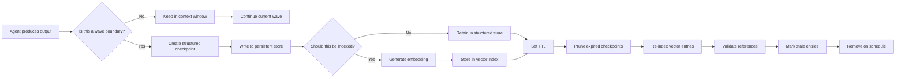

## Multi-Agent Memory Systems: What Actually Works in Production

**Last updated:** May 2026

The fifth turn of the conversation was where it broke.

I was running a multi-agent pipeline where a coordinator agent decomposed a feature request, dispatched tasks to three specialist agents, and collected their outputs for synthesis. On iterations one through four, the system performed flawlessly. By iteration five, the specialist agents started referencing data that no longer existed in the shared context. The coordinator began repeating instructions that had already been executed. One agent proposed a solution identical to one it had produced two turns earlier, apparently unaware it had already completed that work.

What broke was not the reasoning model. What broke was memory.

Memory is the hardest engineering problem in production AI systems. Reasoning capabilities have improved dramatically across every major model provider, but the mechanisms for maintaining, retrieving, and managing state across multiple agents remain primitive by comparison. After building and operating multi-agent systems using the Gem-Team architecture for the past year, I have developed a set of patterns that survive production pressure. This post covers what those patterns are, why they work, and where they fall short.

## The Memory Hierarchy Problem

Every multi-agent system confronts the same fundamental question: what should an agent remember, when should it remember it, and for how long? The answer determines whether the system operates coherently or descends into contradiction and repetition.

### What to Remember

Not everything an agent encounters deserves preservation. The chat history of a code-generation agent contains dozens of intermediate reasoning steps, failed hypotheses, and irrelevant tool outputs. Preserving all of it bloats the context window and degrades response quality. Preserving too little forces the agent to re-derive context that it should carry forward.

The correct approach is to define a memory schema for each agent role. A code-generation agent remembers the file it is editing, the current diff, and the linting errors it encountered. It does not remember the five failed regex attempts it made before arriving at the correct pattern. A testing agent remembers the test suite structure and the last execution result. It does not remember the conversation history with the developer who requested the tests.

### When to Remember

Memory operations carry cost. Writing to a persistent store adds latency to every agent turn. Reading from a vector store adds retrieval time. The timing of these operations determines whether the system feels responsive or sluggish.

In the Gem-Team architecture, memory writes occur at natural boundaries: when an agent completes a subtask, when a checkpoint is explicitly requested, or when the system detects a state transition. Memory reads occur at the start of a new agent invocation and on explicit retrieval requests. This cadence prevents the system from performing useless I/O on every micro-step while ensuring that critical state is preserved.

### For How Long

Retention policies must be explicit. Short-term context (the current conversation window) persists for the duration of a single agent session. Persistent structured state (checkpoints, file diffs, execution results) persists across sessions but has a defined time-to-live. Vector-embedded knowledge persists indefinitely but requires active curation to prevent stale references.

The mistake I see most frequently is treating all memory as permanent. A decision made in one session becomes stale when the codebase changes, but the vector store still returns it as relevant. An agent retrieves an outdated architectural decision and builds on top of it, compounding the error across subsequent turns.

## Three Memory Types

Every production multi-agent system needs three distinct memory mechanisms. Each serves a different purpose and carries different tradeoffs.

### Short-Term Context Window

The context window is the agent's working memory. It contains the current task, recent conversation history, and relevant tool outputs. This is the fastest memory to access and the most expensive to scale.

In practice, the context window works well for tasks that complete within a bounded number of turns. A code review agent that examines a single file and produces comments can operate entirely within its context window. An agent that must coordinate across five files, three API calls, and two database migrations will overflow.

The solution is to treat the context window as a cache, not a database. Keep the most recent and most relevant information there. Archive completed work to persistent storage. Prune redundant or superseded content aggressively.

### Persistent Structured State

Persistent state is where the system stores completed work, accumulated results, and agent decisions that must survive beyond the current session. This is the hardest memory type to get right because it requires a schema.

The Gem-Team approach uses typed checkpoints. Each agent writes its state to a structured checkpoint that includes a schema version, a timestamp, the agent role, and the actual state payload. Downstream agents can query checkpoint history to understand what has already been done and what decisions were made.

```typescript
// Structured checkpoint schema for agent state persistence
// Used by Gem-Team agents to write and read typed checkpoints

interface CheckpointMetadata {
  schemaVersion: number
  agentId: string
  role: string
  sessionId: string
  parentSessionId: string | null
  timestamp: string
  turnNumber: number
}

interface CodeGenerationState {
  metadata: CheckpointMetadata
  payload: {
    targetFile: string
    originalContent: string
    currentDiff: string
    lintsPassed: string[]
    lintsFailed: string[]
    dependentFiles: string[]
    completedTasks: string[]
    pendingTasks: string[]
    decisions: Array<{
      id: string
      description: string
      rationale: string
      alternativesConsidered: string[]
      timestamp: string
    }>
  }
}

class StructuredStateManager {
  private store: Map<string, CodeGenerationState>
  private retentionMs: number

  constructor(retentionMinutes: number = 1440) {
    this.store = new Map()
    this.retentionMs = retentionMinutes * 60 * 1000
  }

  async writeCheckpoint(state: CodeGenerationState): Promise<void> {
    this.store.set(state.metadata.sessionId, state)
    // Archive to persistent store here
    await this.archive(state)
  }

  async readCheckpoint(sessionId: string): Promise<CodeGenerationState | null> {
    const state = this.store.get(sessionId)
    if (!state) return null
    if (this.isExpired(state)) {
      this.store.delete(sessionId)
      return null
    }
    return state
  }

  async getAgentHistory(agentId: string): Promise<CodeGenerationState[]> {
    const results: CodeGenerationState[] = []
    for (const state of this.store.values()) {
      if (state.metadata.agentId === agentId && !this.isExpired(state)) {
        results.push(state)
      }
    }
    return results.sort(
      (a, b) =>
        new Date(a.metadata.timestamp).getTime() -
        new Date(b.metadata.timestamp).getTime(),
    )
  }

  private isExpired(state: CodeGenerationState): boolean {
    const age = Date.now() - new Date(state.metadata.timestamp).getTime()
    return age > this.retentionMs
  }

  private async archive(state: CodeGenerationState): Promise<void> {
    // Write to durable storage (PostgreSQL, S3, etc.)
  }
}
```

The key insight is that typed schemas prevent hallucinated memory. When an agent reads a checkpoint, it receives exactly the fields defined in the schema, no more and no less. The agent cannot fabricate a file diff because the diff field either exists or it does not. This constraint is the single most effective defense against memory corruption.

### Vector-Based Retrieval

Vector memory serves a different purpose: recalling relevant context from past sessions that is not directly related to the current task. An agent building a new authentication system might benefit from reviewing how a previous agent handled token expiration, even though the two tasks are not in the same session.

Vector retrieval works well for similarity search across unstructured or semi-structured content. The challenge is ensuring that retrieved content is relevant and current. A vector store that returns six-month-old architectural decisions alongside fresh code changes creates confusion.

The pattern that works in production is to segment the vector store by time range and agent role. A retrieval query specifies not only the similarity threshold but also the acceptable age range and the originating agent role. This filtering dramatically reduces irrelevant results.

## Common Failure Modes

Building multi-agent memory systems means encountering failure modes that do not exist in single-agent architectures. Here are the four that caused the most damage in my production systems.

### Context Drift

Context drift occurs when an agent's understanding of the current state diverges from reality. The agent believes it is editing version 3 of a file when the file is actually on version 7. The agent references a decision that was reversed two turns ago.

Context drift is insidious because it accumulates gradually. Each turn introduces a small imprecision. By turn ten, the agent operates on a fundamentally incorrect model of the world. The symptoms are baffling: the agent produces code that looks reasonable but references functions that no longer exist or assumes data structures that were refactored earlier.

The fix is to inject ground truth at every agent invocation. Before an agent starts work, provide it with the current state of every resource it might touch. File contents, environment variables, database schemas - whatever the agent needs, inject it as structured data before the agent generates its first token. This adds latency to each invocation but eliminates accumulated drift.

### Hallucinated Memory

Hallucinated memory is different from hallucinated output. The agent does not generate false facts about the world - it generates false facts about what it previously did. It claims to have written a function that it never wrote. It states that it tested a scenario that it never evaluated.

This happens because language models are not databases. When asked "What did you do in the previous turn?", the model does not query a log - it generates a plausible completion based on the conversation history. If the history contains gaps or ambiguities, the model fills them with fabricated content.

The defense against hallucinated memory is to never ask the agent to recall its own history. Instead, provide explicit memory from the checkpoint store. When the agent needs to know what it did, inject the relevant checkpoint data into its context window. The agent reads facts rather than generating them.

### Memory Bloat

Memory bloat is the accumulation of irrelevant or redundant state. Every turn adds content to the context window. Every checkpoint writes data to the persistent store. Over time, the signal-to-noise ratio degrades until the agent cannot find relevant information.

The cause is almost always an overly permissive memory policy. The system stores everything because the developer cannot predict what might be useful later. This approach works in small systems but collapses in production.

The solution is explicit retention policies with automated pruning. Checkpoints expire after a configurable window. Context window content is summarized and archived when it exceeds a threshold. Vector embeddings are re-indexed on a schedule, with stale entries removed. These policies require upfront design but eliminate the gradual degradation that plagues ad-hoc systems.

### Stale References

Stale references occur when memory points to resources that no longer exist or have changed. An agent checkpoint references a file path that was renamed. A decision record cites a dependency version that was upgraded.

This failure mode is particularly common in systems that combine multiple agents working on the same codebase. Agent A writes a checkpoint referencing file X. Agent B reads the checkpoint and depends on file X's structure. Meanwhile, Agent C refactors file X. Agent B now operates on stale data.

The mitigation is to include version metadata in every checkpoint and to validate references before injection. Before an agent reads a checkpoint, verify that the referenced resources still match the checkpoint's expectations. If they do not, flag the checkpoint as stale and exclude it from the agent's context.

## The Gem-Team Approach

The Gem-Team repository codifies the patterns I have described into reusable components. Three patterns have proven most effective in production.

### Wave-Based Checkpointing

Rather than writing state on every turn, the Gem-Team architecture uses wave-based checkpointing. A wave is a logical unit of work - completing a code review, generating a test suite, implementing a feature. The agent writes a checkpoint only at wave boundaries.

This approach reduces write volume by an order of magnitude compared to per-turn checkpointing while preserving all semantically meaningful state. If a wave fails partway through, the checkpoint from the previous successful wave provides a clean recovery point.

Wave boundaries are defined by the agent's task definition. A code-generation agent creates a wave boundary when it finishes editing a file. A testing agent creates a wave boundary when it completes a test run. The system does not need to know the details - it only needs to detect when a wave starts and ends.

### Typed State Schemas

Every agent in the Gem-Team system writes state using a typed schema. The schema defines exactly what the agent remembers and in what format. There is no free-form text field for "notes" or "summary." If the information is important enough to preserve, it gets a field in the schema.

Typed schemas serve two purposes. First, they constrain what the agent can write, preventing hallucinated fields from entering the persistent store. Second, they constrain what downstream agents can read, providing a contract that other agents can depend on.

When a new agent role is added to the system, the first deliverable is not the agent logic - it is the state schema. The schema is reviewed and tested before any code is written. This discipline prevents a class of integration bugs that would otherwise surface only in production.

### Controlled Injection

Controlled injection is the practice of explicitly deciding what memory to place into an agent's context window at invocation time. The system does not dump the entire checkpoint history into the context. It selects the most relevant checkpoints based on the current task, the agent role, and the time window.

The injection logic is itself a small module that takes the task description and returns an ordered list of memory items to inject. Each item includes a source label so the agent can distinguish checkpoint data from conversation history from tool output. This labeling helps the agent prioritize competing sources of information.

Controlled injection eliminated context drift in my systems. The agent receives exactly the memory it needs, explicitly formatted, with no ambiguity about what is true and what is generated.

## Memory Type Tradeoffs

Choosing the right memory mechanism requires understanding their engineering characteristics. The table below summarizes the tradeoffs based on production measurements from my Gem-Team deployments.

| Characteristic     | Short-Term Context     | Persistent Structured   | Vector Retrieval          |
| ------------------ | ---------------------- | ----------------------- | ------------------------- |
| Access latency     | <10ms                  | 10-50ms                 | 50-200ms                  |
| Storage cost       | Free (context-limited) | Low (key-value)         | Medium (index + storage)  |
| Accuracy           | High (current turn)    | High (typed schema)     | Medium (similarity-based) |
| Recall precision   | Exact                  | Exact                   | Approximate               |
| Max useful scale   | ~100K tokens           | Millions of checkpoints | Billions of embeddings    |
| Maintenance burden | None                   | Schema migrations       | Re-indexing, tuning       |
| Failure mode       | Window overflow        | Schema drift            | Relevance degradation     |
| Best for           | Active task state      | Completed work          | Cross-session recall      |

The critical takeaway is that these mechanisms are complementary, not competing. A production system uses all three. The context window holds active state. The structured store holds completed work. The vector store holds searchable knowledge. Each serves a role that the others cannot fill.

## Memory Lifecycle

The following diagram shows how memory flows through the system from creation to pruning.



The lifecycle enforces that memory follows a path from ephemeral context to durable storage to pruned archive. Every checkpoint enters the system at a wave boundary, receives a TTL, and is either pruned or re-indexed on a schedule. No memory persists indefinitely without review.

## When NOT to Use Memory

Memory is not free. Every memory operation adds latency, complexity, and surface area for bugs. There are situations where the correct design choice is to use no memory at all.

### Stateless Agents

An agent that performs pure transformations does not need memory. A translation agent that takes text and returns translated text operates correctly with no context beyond the current input. Adding memory to such an agent introduces risk of contamination between unrelated requests.

The Gem-Team architecture explicitly marks agents as stateful or stateless at definition time. Stateless agents receive no checkpoint history, no session context, and no vector retrieval results. This constraint prevents accidental coupling between independent operations.

### One-Shot Tasks

Some tasks complete in a single agent invocation. Generating a commit message from a diff. Formatting a code block. Converting data between formats. These tasks do not benefit from memory because there is no subsequent invocation that needs the context.

The mistake is adding memory to a one-shot task because "it might be useful later." It will not be useful later. It will consume storage and add retrieval noise. One-shot tasks should be stateless by default, with memory added only when a concrete need is identified.

### Pure Transformations

Any operation that is a pure function of its inputs - same inputs always produce same outputs - does not require memory. A lint fixer that applies deterministic rules. A code formatter. A type annotator.

These tasks benefit from stateless design because stateless systems are trivially testable, trivially parallelizable, and trivially reproducible. Adding memory to a pure transformation makes it harder to debug, harder to test, and harder to reason about.

## Conclusion

Memory is the differentiator between a multi-agent system that works in a demo and one that works in production. Reasoning models improve on a quarterly cadence. Memory architectures must be designed from the ground up and refined through production operation.

My experience building with the Gem-Team patterns has taught me three enduring lessons. First, typed schemas are the most effective defense against memory corruption - they constrain what agents can write and what they can read. Second, explicit memory injection at agent boundaries eliminates context drift better than any amount of prompt engineering. Third, memory requires maintenance - retention policies, pruning schedules, and reference validation are not optional.

The systems that survive production pressure are the ones that treat memory as a first-class architectural concern, not an afterthought. Design your memory before you design your agents. The reasoning will take care of itself.
