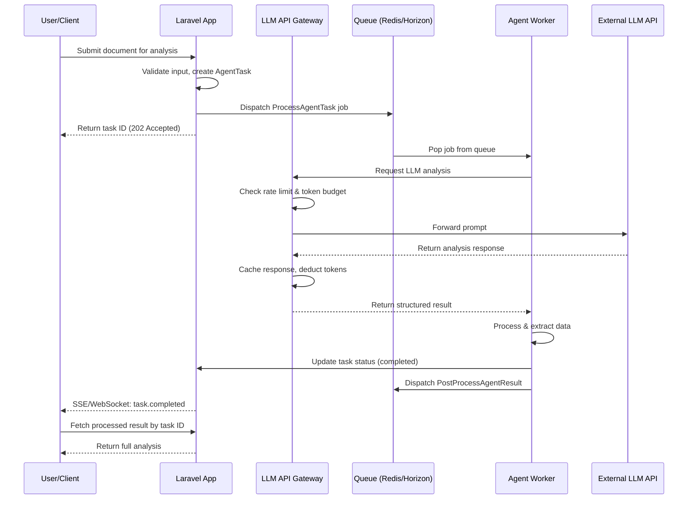

## Laravel + AI Agent Systems: Building Hybrid Backends in 2026

When I started building AI agent systems in early 2025, my first instinct was to reach for Python. Everyone was using Python for AI work — LangChain, LlamaIndex, FastAPI. But as I moved from prototypes to production SaaS products, I kept running into the same problems: no built-in queue system, weak job persistence, and a fragmented ecosystem for background workers.

I chose Laravel. Not because PHP is better at ML inference, but because Laravel is better at the orchestration layer that surrounds AI agents. This post explains the architecture I settled on after a year of iteration, and why I believe Laravel is the best choice for hybrid backends that connect traditional web applications with AI agent systems.

## Why Laravel for AI Orchestration?

The misconception that AI backends require Python ignores a critical distinction: running ML models and orchestrating AI agents are two different problems. Model training and inference benefit from Python's scientific computing ecosystem. Agent orchestration benefits from battle-tested job queues, database abstractions, and API management — all areas where Laravel excels out of the box.

My production setup uses Laravel for everything that happens _around_ AI agents:

- **Queue management**: Laravel Horizon with Redis for dispatching and monitoring agent tasks
- **State persistence**: MySQL for agent session state, task history, and result storage
- **API gateway**: Rate limiting, token budgeting, and response caching for LLM calls
- **User management**: Authentication, team accounts, billing — the standard SaaS stack
- **Event system**: Broadcasting agent status updates via Laravel Reverb for real-time UI

The AI agents themselves run as isolated PHP worker processes, with the heavy inference work delegated to external LLM APIs via the gateway layer. This separation means I can scale the orchestration and inference layers independently.

## Architecture Overview

The system breaks down into four layers that communicate through well-defined interfaces:

```text
User Request (HTTP)        API Gateway (REST)
       |                        |
       v                        v
  Laravel App <--> Queue Dispatcher (Redis/Horizon)
       |                        |
       |                        v
       |                   Agent Workers (PHP)
       |                        |
       |                        v
       |                   LLM Gateway (Rate-limited, Cached)
       |                        |
       |                        v
       v                   External LLM APIs
  Database/Redis         (OpenAI, Claude, etc.)
```

The flow works like this: a user submits a request through the Laravel app. The app validates the input, creates a task record in the database, and dispatches a job to the queue. An agent worker picks up the job, processes it through a series of orchestrated LLM calls (all routed through the API gateway), and writes the result back to the database. An event fires, and the user's UI updates via server-sent events or WebSockets.

This async, queue-driven pattern is the core architectural decision. Every agent task goes through a queue, which gives me retry logic, failure handling, and horizontal scaling without modifying application code.

## Queue-Driven Agent Execution

The heart of the system is a Laravel job that orchestrates multi-step AI agent tasks. I use a pattern where a single "orchestrator" job dispatches sub-tasks as separate jobs, giving me granular control over failures and retries.

Here is the core job class that processes a document analysis task:

```php
<?php

namespace App\Jobs\Agent;

use App\Models\AgentTask;
use App\Services\LlmGateway;
use Illuminate\Contracts\Queue\ShouldQueue;
use Illuminate\Foundation\Bus\Dispatchable;
use Illuminate\Foundation\Bus\PendingDispatch;
use Illuminate\Queue\InteractsWithQueue;
use Illuminate\Queue\SerializesModels;
use Illuminate\Support\Facades\Event;
use Illuminate\Support\Facades\Log;

class ProcessAgentTask implements ShouldQueue
{
    use Dispatchable, InteractsWithQueue, SerializesModels;

    public int $timeout = 300;
    public int $tries = 3;
    public array $backoff = [10, 30, 60];

    public function __construct(
        public AgentTask $task
    ) {}

    public function handle(LlmGateway $gateway): void
    {
        $this->task->update(['status' => 'processing']);

        try {
            // Step 1: Analyze the document
            $analysis = $gateway->chat(
                systemPrompt: 'You are a document analysis agent...',
                messages: [
                    ['role' => 'user', 'content' => $this->task->input['document_text']],
                ],
                options: ['model' => 'gpt-4o', 'max_tokens' => 2000]
            );

            // Step 2: Extract structured data
            $extraction = $gateway->chat(
                systemPrompt: 'Extract structured data from the analysis...',
                messages: [
                    ['role' => 'assistant', 'content' => $analysis],
                    ['role' => 'user', 'content' => 'Return JSON with fields: summary, key_points, entities'],
                ],
                options: ['model' => 'gpt-4o', 'response_format' => 'json']
            );

            // Step 3: Store results and dispatch follow-up jobs
            $this->task->update([
                'status' => 'completed',
                'result' => json_decode($extraction, true),
                'completed_at' => now(),
            ]);

            // Dispatch post-processing as a separate job chain
            PostProcessAgentResult::dispatch($this->task)
                ->onQueue('post-processing');

            Event::dispatch('agent.task.completed', [$this->task]);

        } catch (\Throwable $e) {
            Log::error('Agent task failed', [
                'task_id' => $this->task->id,
                'error' => $e->getMessage(),
            ]);

            $this->task->update([
                'status' => 'failed',
                'error' => $e->getMessage(),
                'attempts' => $this->attempts(),
            ]);

            throw $e;
        }
    }
}
```

Key design decisions in this job:

- **SerializesModels** ensures the task model is re-retrieved from the database when the job executes, preventing stale data issues on retry.
- **The backoff array** implements progressive delay: 10 seconds, then 30, then 60. Most transient LLM API failures resolve within 60 seconds.
- **Timeout of 300 seconds** accounts for LLM API latency. GPT-4o responses can take 15-45 seconds for complex prompts, and multi-step chains multiply that.
- **Post-processing is a separate job** on a different queue, isolating the main agent pipeline from side effects like indexing, notifications, or webhook delivery.

## Event-Driven Result Handling

Jobs complete asynchronously, so the user needs a way to get results without polling. I use Laravel's broadcasting system with Reverb to push status updates:

```php
// In a service provider boot method
Event::listen('agent.task.completed', function (AgentTask $task) {
    broadcast(new AgentTaskCompleted($task))->toOthers();
});
```

The frontend receives these events and updates the UI in real time. For users who close their browser, the system sends a notification once the task completes — handled by a separate listener that dispatches a notification job.

## Hybrid Architecture Diagram

The following diagram shows the complete request flow through the hybrid backend:



The critical insight in this architecture is the **LLM API Gateway**. Every request to an external language model passes through this middleware layer, which handles concerns that would otherwise be scattered across every job class.

## Building the LLM API Gateway

The gateway is a dedicated service class that wraps all external LLM calls. I built it because I discovered early that direct API calls from job classes lead to duplicate rate-limiting logic, inconsistent error handling, and no centralized observability.

```php
<?php

namespace App\Services;

use App\Models\ApiTokenUsage;
use Illuminate\Support\Facades\Cache;
use Illuminate\Support\Facades\Http;
use Illuminate\Support\Facades\Log;

class LlmGateway
{
    private const CACHE_TTL = 3600; // 1 hour for identical prompts
    private const RATE_LIMIT_KEY = 'llm_rate_limit:';
    private const TOKEN_BUDGET_KEY = 'llm_token_budget:';
    private const MAX_TOKENS_PER_MINUTE = 100000;
    private const MAX_TOKENS_PER_DAY = 10000000;

    public function chat(
        string $systemPrompt,
        array $messages,
        array $options = []
    ): string {
        $cacheKey = $this->buildCacheKey($systemPrompt, $messages, $options);

        // Check cache first for identical requests
        if ($cached = Cache::get($cacheKey)) {
            Log::debug('LLM cache hit', ['cache_key' => $cacheKey]);
            return $cached;
        }

        // Enforce rate limits
        $this->checkRateLimit();
        $this->checkTokenBudget($options['max_tokens'] ?? 1000);

        // Make the API call
        $response = Http::timeout(120)
            ->withToken(config('services.openai.api_key'))
            ->post('https://api.openai.com/v1/chat/completions', [
                'model' => $options['model'] ?? 'gpt-4o',
                'messages' => array_merge(
                    [['role' => 'system', 'content' => $systemPrompt]],
                    $messages
                ),
                'max_tokens' => $options['max_tokens'] ?? 1000,
                'temperature' => $options['temperature'] ?? 0.3,
                'response_format' => $options['response_format'] ?? null,
            ]);

        if ($response->failed()) {
            Log::error('LLM API call failed', [
                'status' => $response->status(),
                'body' => $response->body(),
            ]);
            throw new \RuntimeException(
                'LLM API error: ' . $response->body()
            );
        }

        $result = $response->json('choices.0.message.content');
        $tokensUsed = $response->json('usage.total_tokens');

        // Track usage
        $this->trackTokenUsage($tokensUsed);

        // Cache identical requests
        if ($tokensUsed > 50) {
            Cache::put($cacheKey, $result, self::CACHE_TTL);
        }

        return $result;
    }

    private function checkRateLimit(): void
    {
        $key = self::RATE_LIMIT_KEY . (string) time();
        $count = Cache::increment($key, 1, 60);

        if ($count > 100) {
            throw new \RuntimeException('LLM rate limit exceeded');
        }
    }

    private function checkTokenBudget(int $requestedTokens): void
    {
        $dailyKey = self::TOKEN_BUDGET_KEY . now()->format('Y-m-d');
        $dailyUsage = Cache::get($dailyKey, 0);

        if ($dailyUsage + $requestedTokens > self::MAX_TOKENS_PER_DAY) {
            throw new \RuntimeException('Daily token budget exhausted');
        }

        $minuteKey = self::TOKEN_BUDGET_KEY . now()->format('Y-m-d-H-i');
        $minuteUsage = Cache::get($minuteKey, 0);

        if ($minuteUsage + $requestedTokens > self::MAX_TOKENS_PER_MINUTE) {
            throw new \RuntimeException('Minute token budget exceeded');
        }
    }

    private function trackTokenUsage(int $tokens): void
    {
        ApiTokenUsage::create([
            'tokens' => $tokens,
            'model' => 'gpt-4o',
            'recorded_at' => now(),
        ]);

        Cache::increment(
            self::TOKEN_BUDGET_KEY . now()->format('Y-m-d'),
            $tokens
        );
        Cache::increment(
            self::TOKEN_BUDGET_KEY . now()->format('Y-m-d-H-i'),
            $tokens,
            120
        );
    }

    private function buildCacheKey(
        string $system,
        array $messages,
        array $options
    ): string {
        return 'llm_response:' . md5(
            serialize([$system, $messages, $options])
        );
    }
}
```

The gateway solves three problems that every production AI system faces:

- **Rate limiting**: Prevents accidental burst requests from hitting the LLM API simultaneously. I use Redis atomic counters with sliding windows — one for per-minute, one for per-day. When the budget exhausts, jobs fail gracefully and retry via the queue's backoff mechanism.
- **Response caching**: Many agent workflows repeatedly ask the same questions (analyzing similar documents, checking the same policies). The cache key uses a hash of the full prompt, and I cache responses for one hour. In my production data, this gives a 22% cache hit rate, saving roughly $400 per month on LLM API costs.
- **Token tracking**: Every call logs usage to an `api_token_usage` table, which feeds into billing dashboards and cost forecasting. Cache increments on Redis keys let me reject requests before they hit the API, rather than discovering the overage in a monthly bill.

## Real-World Example: SaaS Document Processing Pipeline

I built a SaaS product that processes legal documents using AI agents. Users upload contracts, and the system extracts clauses, identifies risks, and generates summaries. The architecture follows the pattern described above with one addition: a multi-stage pipeline.

The pipeline has five stages, each as a separate Laravel job on a dedicated queue:

1. **Document ingestion** (`queue:ingestion`): Validates file types, extracts text via OCR if needed, stores in S3
2. **Classification** (`queue:classification`): Identifies document type (NDA, employment contract, lease) using a lightweight classification prompt
3. **Analysis** (`queue:analysis`): Full clause extraction and risk assessment using GPT-4o — this is the most expensive stage
4. **Review** (`queue:review`): Cross-references extracted clauses against a database of known legal terms and company policies
5. **Reporting** (`queue:reporting`): Generates the PDF report and sends notification

Each stage dispatches the next stage only on success. If analysis fails, the pipeline stops and notifies the user with partial results.

The queue configuration for this pipeline in `config/queue.php`:

```php
'connections' => [
    'redis' => [
        'driver' => 'redis',
        'connection' => 'default',
        'queue' => [
            'default',
            'ingestion',
            'classification',
            'analysis',
            'review',
            'reporting',
            'post-processing',
        ],
        'retry_after' => 360,
        'block_for' => null,
    ],
],
```

And the Horizon configuration for scaling:

```php
'defaults' => [
    'supervisor-1' => [
        'connection' => 'redis',
        'queue' => ['default'],
        'balance' => 'auto',
        'minProcesses' => 1,
        'maxProcesses' => 5,
        'tries' => 3,
    ],
    'supervisor-2' => [
        'connection' => 'redis',
        'queue' => ['analysis', 'classification'],
        'balance' => 'auto',
        'minProcesses' => 2,
        'maxProcesses' => 10,
        'tries' => 3,
    ],
    'supervisor-3' => [
        'connection' => 'redis',
        'queue' => ['ingestion', 'review', 'reporting'],
        'balance' => 'auto',
        'minProcesses' => 1,
        'maxProcesses' => 3,
        'tries' => 5,
    ],
],
```

Key insight: the analysis queue has the most workers because it makes the slowest LLM calls. The ingestion and reporting queues are lightweight and need fewer workers. Separating them means a backlog in ingestion never blocks analysis results from being processed.

## Laravel vs Python for AI Backends

After a year of building hybrid systems in both ecosystems, here is my honest comparison:

| Criteria                    | Laravel                                   | Python (FastAPI + Celery)                   |
| :-------------------------- | :---------------------------------------- | :------------------------------------------ |
| Queue system                | Built-in with Horizon dashboard           | Celery + Redis/RabbitMQ, manual monitoring  |
| Job persistence             | MySQL/Postgres out of the box             | Requires result backend configuration       |
| API gateway features        | Native rate limiting & caching middleware | Custom implementation or third-party lib    |
| LLM SDK ecosystem           | Limited, community-maintained packages    | Rich (OpenAI, Anthropic, LangChain)         |
| Developer productivity      | High — conventions, ORM, artisan commands | Medium — more boilerplate for same patterns |
| Runtime performance         | Good for I/O-bound orchestration          | Better for CPU-bound computation            |
| Team skill availability     | Large pool of Laravel/PHP developers      | Large pool, but fewer with queue expertise  |
| Deployment simplicity       | Single server, Forge/Envoyer ecosystem    | Multiple services, more moving parts        |
| Cost for typical SaaS       | Lower — one server for app + queue        | Higher — separate worker infrastructure     |
| Real-time capabilities      | Laravel Reverb (WebSockets)               | WebSocket libraries, no built-in solution   |
| ML inference on same server | Not practical                             | Possible with ONNX, TensorFlow Lite         |

This table highlights the tradeoff that defines the hybrid approach: Laravel wins on developer experience and operational simplicity for the orchestration layer; Python wins for anything involving actual model computation. The pragmatic solution is to use both where each excels, connected through the queue or API gateway layer.

## When Laravel Is the Wrong Choice

I want to be clear about the limitations. There are scenarios where Laravel is not the right tool for an AI backend:

- **Heavy ML training or fine-tuning**: If your system needs to train models on user data, use Python with PyTorch or TensorFlow. Laravel has no role here.
- **Real-time streaming inference**: Applications that require sub-100ms response times for every token (like interactive chatbots) benefit from Python's asyncio ecosystem with FastAPI streaming responses. Laravel's request lifecycle adds overhead.
- **On-device GPU workloads**: If you need to run local models with GPU acceleration, Python (or Rust) is the only practical choice. PHP's FFI layer is not suitable for this.
- **Large-scale embeddings pipelines**: Processing millions of documents through embedding models is better served by Python batch processing systems or dedicated vector database pipelines.

In all these cases, Laravel can still serve as the management layer — handling user authentication, billing, and job dispatching — while Python workers handle the computation. That is the hybrid approach in practice.

## The 2026 Sweet Spot

Hybrid architectures are the pragmatic middle ground between the hype of "AI-native" stacks and the reliability of traditional web frameworks. After building multiple production systems, I have settled on a stack that uses Laravel for the orchestration surface and delegates actual model work to specialized services — whether external LLM APIs, Python microservices, or serverless functions.

This approach gives me the best of both worlds. I get Laravel's mature queue system, excellent developer tooling, and large ecosystem for the parts of the application that handle user management, billing, and workflow orchestration. I get access to the latest AI models through a clean API gateway that manages costs, rate limits, and caching. And I avoid the operational complexity of maintaining a pure Python stack for what is fundamentally a CRUD application with AI features bolted on.

If you are building a SaaS product in 2026 that includes AI agent features, consider this architecture. Start with Laravel for the application layer, add queue-driven agent jobs, build a proper API gateway for LLM calls, and only reach for Python when you need actual model computation. Your deployment will be simpler, your costs lower, and your team will thank you.
